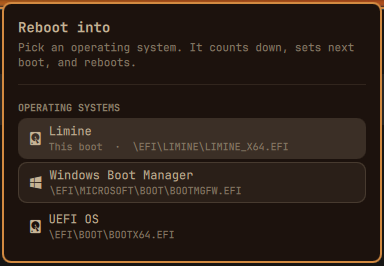
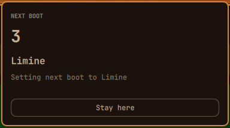

# Reboot into

An [Omarchy](https://omarchy.org/) bar plugin. The restart glyph sits in the
top bar. Open it and the menu lists the operating systems in the firmware boot
menu. Pick one and the panel counts down, types out what it is about to do,
then reboots into that system for the next boot only.

The popup uses the shell theme: popup surface, bar foreground, bar font, and
the same hover and selected fills as the built-in panels.





## Install

Omarchy with the Quickshell shell, plus `efibootmgr` and `jq`. Both ship with
Omarchy.

```bash
omarchy plugin add https://github.com/07dcolem/omarchy-target-boot.git --enable
```

The icon lands on the right of the bar. Move it with:

```bash
omarchy bar move io.github.07dcolem.target-boot --section right
```

Remove it with:

```bash
omarchy plugin remove io.github.07dcolem.target-boot
```

## Using it

| Where | Action |
|---|---|
| Bar icon | left click opens the menu, right click reads the firmware again |
| Operating system row | starts the countdown for that system |
| Stay here | cancels the countdown |
| Clear next boot | drops a next boot that is already armed |

Keyboard, while the menu is open:

| Key | Action |
|---|---|
| `j` `k` ↑ ↓ | move |
| `Enter` `Space` | start the countdown for the highlighted system |
| `Esc` | cancel the countdown, or close the menu |
| `r` | read the firmware again |
| `Tab` | move to the next bar panel |

The current system is marked **This boot**. A system already chosen for the
following boot is marked **Next boot**.

### The countdown

Choosing a system does not reboot on the click. The menu crossfades into a
hold of about four and a half seconds:

1. **3** — “Setting next boot to …” types out under the name.
2. **2** — “The saved boot order stays as it is.”
3. **1** — “Rebooting into …”

The numeral fades and settles on each step. Esc or **Stay here** returns to
the list, and at that point the firmware has not been touched. When the hold
ends, the restart glyph pulses, next boot is set, and Omarchy runs its own
reboot (the “Rebooting” indicator, then windows close).

Dismissing the menu during the hold cancels it. Once next boot has been
written, the reboot continues.

## What gets written

The only firmware write is the one-shot **BootNext** variable
(`efibootmgr --bootnext`). The firmware consumes it on the next boot and then
drops it, so the boot after that follows the saved order again.

Boot order, which entries exist, the active flag on each entry, and the
firmware timeout all stay as they are. After the write, the helper reads the
menu back and compares the boot order with what it was. The reboot starts only
when next boot matches the system you picked and the boot order is unchanged.

Clearing an armed next boot is `efibootmgr --delete-bootnext`, which removes
that same one-shot variable.

Writing next boot needs root. The helper drops the caller’s environment and
runs only the system copy of `efibootmgr`. Passwordless `sudo` is used when
the machine already allows that program without a password. Otherwise
`pkexec` asks through Omarchy’s polkit prompt, and that prompt appears at
the end of the countdown. The reboot itself runs as you, through
`omarchy system reboot`, because the logged-in session is already allowed
to reboot.

## Settings

Set these on the widget entry in `~/.config/omarchy/shell.json`, or in
Setup → Plugins.

| Key | Default | What it does |
|---|---|---|
| `showInactive` | `false` | Also list firmware entries marked inactive |

## Scripting

The panel talks to `bin/target-boot`. From a shell:

```bash
~/.config/omarchy/plugins/io.github.07dcolem.target-boot/bin/target-boot list
~/.config/omarchy/plugins/io.github.07dcolem.target-boot/bin/target-boot reboot-into 0001
~/.config/omarchy/plugins/io.github.07dcolem.target-boot/bin/target-boot bootnext 0001
~/.config/omarchy/plugins/io.github.07dcolem.target-boot/bin/target-boot clear-next
```

`list` is JSON. `reboot-into` sets next boot and reboots. `bootnext` sets next
boot and returns, which is the way to arm a system without leaving this one.
`clear-next` removes it. `--dry-run` prints the exact argv and does not touch
the firmware.

From the running shell:

```bash
omarchy-shell io.github.07dcolem.target-boot toggle
omarchy-shell io.github.07dcolem.target-boot list
omarchy-shell io.github.07dcolem.target-boot rebootInto 0001
```

`rebootInto` opens the menu and starts the same countdown. It does not skip
the hold.

## How it works

`Panel.qml` is the bar widget and the popup. `Model.js` is the countdown copy,
the row text, and the JSON parsing, with no processes in it. `bin/target-boot`
is the only thing that runs `efibootmgr`.

Device paths and labels are firmware data. Every line of text in the panel is
plain text, and labels are passed to `jq` as arguments, so a name cannot
become a command or markup.

A saved `efibootmgr` listing can be passed with `--fixture` for tests. A
fixture is refused when the command would actually write.

```bash
node test/model.test.js
bash test/script.test.sh
omarchy plugin validate .
```

## License

MIT
